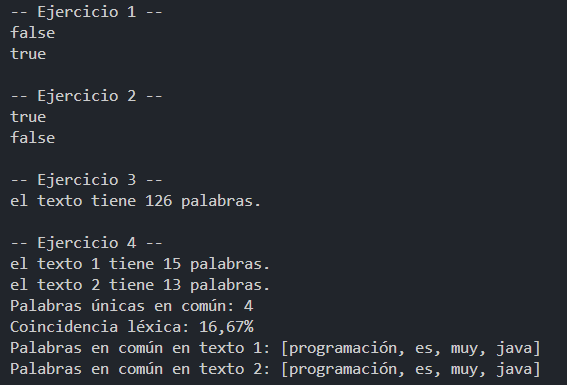

# SETS

## 📌 Información General

- **Título:** Sets
- **Asignatura:** Estructura de Datos
- **Carrera:** Computación
- **Estudiante:** Kevin Paladines
- **Fecha:** 01/07/2025
- **Profesor:** Ing. Pablo Torres

---

## 🧩 Estructura del proyecto
    src/
    │
    ├── controllers
    │   └── Sets.java
    │
    └── App.java

    ---

---
## 🧑‍💻 Ejemplo de Entrada y Salida
- **Ejercicio 1**

- **Ejercicio 2**

- **Ejercicio 3**
